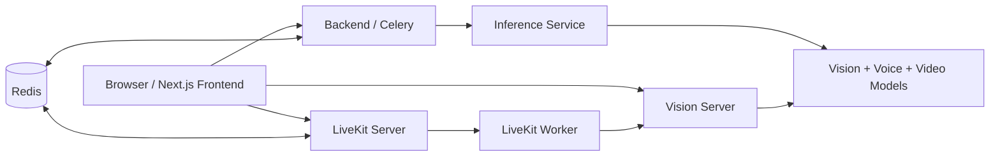

# InterviewAR

Multi-service interview intelligence platform for live, recorded, and chunked interview analysis.

The workspace combines a Next.js frontend, a Redis/Celery backend, a FastAPI inference service, a LiveKit media stack, and two model-focused subprojects for video and voice evaluation. The system is built to capture camera and microphone input, split recordings into chunks, run ML analysis, and surface live feedback in the browser.

## System Overview



## Tech Stack

- Frontend: Next.js 16, React 19, TypeScript, Tailwind CSS v4, LiveKit client, GSAP, Lucide icons.
- Backend orchestration: Python, Redis, Celery.
- Inference API: FastAPI, Pydantic, asyncio.
- Vision and ML runtime: OpenCV, MediaPipe, PyTorch, Hugging Face Transformers, soundfile, ffmpeg.
- Media infrastructure: Docker Compose, LiveKit server, LiveKit Agents worker.

## Setup

### 1. Prerequisites

- Windows with PowerShell.
- Docker Desktop running.
- Node.js 20+ for the frontend.
- A Python conda environment that matches the scripts, with `pupil310` as the default in `start-system.ps1`.
- `ffmpeg` on `PATH`, or set `FFMPEG_PATH` for the vision pipeline.
- Optional GPU/CUDA support for faster PyTorch inference.

### 2. Environment Variables

Copy the root sample file and fill in the values for your machine:

```bash
copy .env.example .env
```

The frontend also expects a matching `frontend/.env.local` when you run it directly. The LiveKit diagnostics script checks for:

- `NEXT_PUBLIC_LIVEKIT_URL`
- `LIVEKIT_URL`
- `LIVEKIT_API_KEY`
- `LIVEKIT_API_SECRET`

### 3. Frontend Install

```bash
cd frontend
npm install
```

### 4. Python Runtime Notes

This repository does not use one single Python package file for every service. The main runtime is launched from the existing conda environment referenced by `start-system.ps1`, while the model subprojects have their own dependency files and documentation.

- `Atempt2/` uses `environment.yaml` and its own model-training pipeline.
- `Voice_Evaluation_PRJ3/` uses `requirements.txt` and its own Wav2Vec2 project README.

## Run the Platform

The quickest way to start everything on Windows is:

```powershell
.
start-system.ps1
```

That script starts:

- Docker infrastructure (`redis` and `livekit` from `docker-compose.yml`)
- The FastAPI inference service on port `8001`
- The Celery worker
- The vision server
- The Next.js frontend on port `3000`

If you want to start services manually:

```powershell
docker compose up -d
cd inference-service
uvicorn main:app --host 0.0.0.0 --port 8001
```

```powershell
celery -A backend.worker.celery_app worker -l info --queues "control,chunk-control,chunk-inference,chunk-results"
```

```powershell
python Vision/vision_server.py
```

```bash
cd frontend
npm run dev
```

## Diagnostics

- `check-livekit.ps1` validates LiveKit credentials, container health, port availability, and frontend dependencies.
- `LIVEKIT_TROUBLESHOOTING.md` contains operational notes for connection issues.
- `docker-compose.yml` is the source of truth for Redis and LiveKit during local development.

## Important Files

### Root Orchestration

- `docker-compose.yml` - Starts Redis and the LiveKit server. The Redis service backs both signaling and Celery, and LiveKit is configured for local media transport and UDP media ports.
- `livekit.yaml` - LiveKit server configuration, including Redis address, API keys, room settings, and UDP port range.
- `start-system.ps1` - Windows bootstrap script that launches the entire stack in the right order.
- `check-livekit.ps1` - Health and configuration validator for LiveKit, environment variables, and frontend dependencies.
- `.env.example` - Shared environment template for LiveKit, Redis, Celery, and inference service URLs.

### Frontend

- `frontend/package.json` - Next.js app manifest and script entry points.
- `frontend/src/app/layout.tsx` - Root layout and global metadata for the app shell.
- `frontend/src/app/page.tsx` - Home route that renders the landing page.
- `frontend/src/app/interview/page.tsx` - Interview route that mounts the live interview room.
- `frontend/src/app/globals.css` - Global Tailwind CSS theme, variables, and animation utilities.
- `frontend/src/app/pages/homepage.tsx` - Animated marketing landing page with client-side motion effects and route navigation.
- `frontend/src/app/pages/homepage.module.css` - Scoped CSS animation helpers for the landing page.
- `frontend/src/app/component/InterviewRoom.tsx` - Main interview experience. Uses React state, fullscreen APIs, LiveKit, chunked recording, vision session state, and results overlays.
- `frontend/src/app/component/CalibrationFlow.tsx` - Multi-step calibration screen for the eye-tracking flow.
- `frontend/src/app/component/VisionSessionControl.tsx` - UI wrapper for starting and stopping vision sessions and rendering gaze results.
- `frontend/src/app/component/InterviewWithVisionTracking.tsx` - Example interview screen that shows how to embed gaze tracking controls.
- `frontend/src/app/component/LiveKitDebugPanel.tsx` - Debug panel for LiveKit health and token checks.
- `frontend/src/app/component/GazeDebugPanel.tsx` - Debug panel for gaze metrics, calibration state, and marker controls.
- `frontend/src/app/hooks/useLiveKitInterview.ts` - LiveKit connection hook that creates rooms, publishes local audio/video tracks, and retries on failure.
- `frontend/src/app/hooks/useChunkedRecorder.ts` - Browser MediaRecorder hook that captures 15-second chunks and uploads them to the vision server.
- `frontend/src/app/hooks/useVisionSession.ts` - WebSocket session hook for chunk processing, prediction updates, and session lifecycle state.
- `frontend/src/app/hooks/useChunkedVisionSession.ts` - Alternate chunked-session hook for webcam capture plus server-side chunk analysis.
- `frontend/src/app/hooks/useGazeTracking.ts` - Lower-level gaze tracking hook that streams frames over WebSocket and issues calibration commands.
- `frontend/src/app/api/livekit-health/route.ts` - Server-side health endpoint that validates LiveKit environment variables.
- `frontend/src/app/api/livekit-token/route.ts` - Token generator using `livekit-server-sdk.AccessToken`.

### Backend and Queueing

- `backend/redis_client.py` - Redis-backed session store for chunks, events, and session metadata.
- `backend/worker.py` - Celery application configuration, queues, serializers, and routing.
- `backend/tasks.py` - Celery tasks for health checks, chunk enqueueing, inference dispatch, and result persistence.

### Inference Service

- `inference-service/main.py` - FastAPI app with a lifespan loader and `/infer/chunk` endpoint.
- `inference-service/models.py` - Loads and coordinates analyzers from the vision stack, then runs them in parallel with `asyncio`.

### Vision and Media Processing

- `Vision/vision_server.py` - Main multimodal analysis server. Uses FastAPI, OpenCV, MediaPipe, PyTorch, Transformers, and ffmpeg to load voice, VideoMAE, facial, and gaze analyzers.
- `Vision/realtime_inference.py` - Offline chunk processor that samples frames from each recorded chunk and writes per-session predictions.
- `Vision/vision.py` - Gaze and screen-calibration runtime used by the vision server.
- `Vision/data/` - Runtime output for gaze logs, predictions, uploads, and session artifacts.

### LiveKit Worker

- `livekit-worker/agent.py` - LiveKit Agents worker that subscribes to rooms, buffers video tracks, and manages chunk lifecycle events.
- `livekit-worker/buffer.py` - Frame-buffering and chunk-building logic for remote LiveKit video tracks.

### Video Model Project (`Atempt2/`)

- `Atempt2/README.md` - Project-level documentation for the ranking-supervised video model.
- `Atempt2/environment.yaml` - Conda environment definition for the training and evaluation stack.
- `Atempt2/config.yaml` - Project configuration for model and training parameters.
- `Atempt2/evaluate_models.py` - Evaluation entry point for comparing trained models.
- `Atempt2/validate_inference.py` - Inference validation utility.
- `Atempt2/scripts/extract_audio.py` - Helper for pulling audio from video files.
- `Atempt2/src/dataset/*.py` - Dataset loaders and inspectors for RecruitView data.
- `Atempt2/src/model/*.py` - Audio and video model definitions used by the project.
- `Atempt2/src/training/*.py` - Training scripts, loss definitions, and checkpoint handling.
- `Atempt2/checkpoints/` - Saved model weights used by the runtime services.

### Voice Model Project (`Voice_Evaluation_PRJ3/`)

- `Voice_Evaluation_PRJ3/README.md` - Detailed Wav2Vec2 project documentation, training notes, and usage examples.
- `Voice_Evaluation_PRJ3/requirements.txt` - Python dependency list for the voice evaluation project.
- `Voice_Evaluation_PRJ3/voice_evaluation_wav2vec.py` - Standalone evaluation script for scoring and comparing voice samples.
- `Voice_Evaluation_PRJ3/src/model/voice_wav2vec_model.py` - Wav2Vec2 regression model used for speaking-skills scoring.
- `Voice_Evaluation_PRJ3/src/dataset/voice_wav_dataset.py` - Dataset loader for voice training data.
- `Voice_Evaluation_PRJ3/src/training/*.py` - Training and validation scripts for voice ranking models.

## Operational Notes

- The root app is a multi-service system, not a single executable.
- The vision and inference stack depends on local model checkpoints and on `ffmpeg` for video-to-audio conversion and codec normalization.
- Production deployment should replace the development LiveKit keys in `docker-compose.yml` and `livekit.yaml`.
- The frontend assumes the LiveKit and vision services are reachable on local ports unless environment variables override them.

## Suggested Next Steps

1. Add a `.env` and `frontend/.env.local` for your local machine.
2. Run `start-system.ps1` and verify the browser flow at `/interview`.
3. If you want, I can also create a more detailed setup README inside each subproject so the root document can stay shorter.