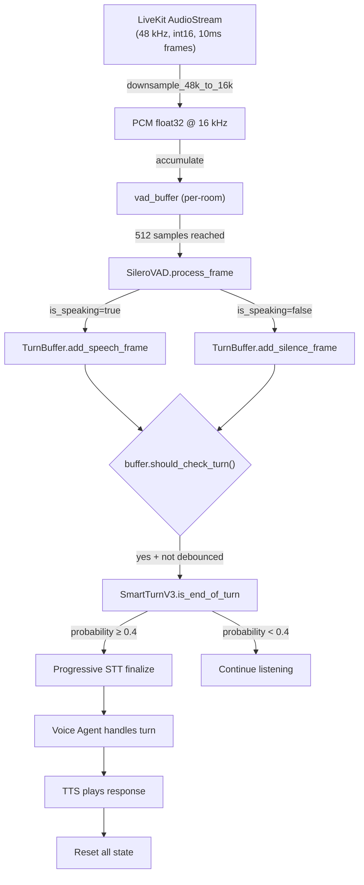
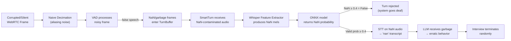

# Turn Detection Pipeline — Deep Analysis & Rating

## 1. End-to-End Data Flow



---

## 2. Component-by-Component Analysis

### 2.1 Downsampling — [main.py:206-211](file:///c:/Users/SHREY/Desktop/Lattice/convFlow/main.py#L206-L211)

```python
def downsample_48k_to_16k(pcm_int16: np.ndarray) -> np.ndarray:
    audio = pcm_int16.astype(np.float32) / 32768.0
    return audio[::3]  # ← Naive decimation
```

**Rating: ⚠️ 4/10**

| Issue | Severity | Detail |
|-------|----------|--------|
| **No anti-alias filter** | 🔴 High | `audio[::3]` is a naive stride-skip. Any frequency content between 8–24 kHz folds back into the 0–8 kHz band as aliased noise. This **directly corrupts** both Silero VAD and SmartTurn features. |
| **Potential NaN source** | 🔴 Critical | If LiveKit ever delivers a frame with int16 value `0` for all samples and some edge condition produces `0/0` downstream, or if a corrupted WebRTC frame contains unexpected values, you get NaN propagation from this point onward. |

> [!WARNING]
> Naive decimation is a known source of phantom speech detections. The aliased high-frequency noise masquerades as speech energy, causing VAD to fire spuriously, which in turn feeds garbage audio into SmartTurn.

---

### 2.2 VAD — [vad.py](file:///c:/Users/SHREY/Desktop/Lattice/convFlow/audio/vad.py)

**Rating: ⚠️ 5/10**

| Issue | Severity | Detail |
|-------|----------|--------|
| **Global singleton shared across rooms** | 🔴 Critical | `vad = SileroVAD()` at [main.py:198](file:///c:/Users/SHREY/Desktop/Lattice/convFlow/main.py#L198) is a **single instance** shared across all concurrent interview rooms. Silero VAD is **stateful** (it maintains internal LSTM hidden state). When two rooms interleave `process_frame()` calls, Room A's audio corrupts Room B's VAD state. This is a **major correctness bug** in a multi-room server. |
| **No NaN/Inf guard on input** | 🟡 Medium | `process_frame()` passes `frame` directly to `torch.from_numpy(frame)` → `self.model(audio_tensor, ...)`. If the frame contains NaN (from a corrupted audio packet or the naive downsampling), Silero returns NaN as `speech_prob`. Then `speech_prob >= self.speech_threshold` evaluates to `False` (NaN comparisons are always False), so VAD silently enters "silence" mode regardless of actual speech. |
| **No model reset between rooms** | 🟡 Medium | `reset()` only clears `_silent_frames` and `_is_speaking`, but does **not** call `self.model.reset_states()`. Silero's internal LSTM state carries over between turns and across rooms. |
| **Frame size mismatch handled externally** | 🟢 OK | The 10ms → 32ms accumulation in `main.py` is a valid pattern, but see below for issues with the accumulator. |

> [!CAUTION]
> **The shared global VAD is the single most dangerous bug in the system.** In production with multiple concurrent rooms, this will cause cross-contamination of VAD decisions. One room's silence can make another room's speech go undetected, and vice versa.

---

### 2.3 TurnBuffer — [buffer.py](file:///c:/Users/SHREY/Desktop/Lattice/convFlow/audio/buffer.py)

**Rating: 🟢 7/10**

This is the best-designed component in the pipeline. Clean separation of concerns, proper rolling window management.

| Issue | Severity | Detail |
|-------|----------|--------|
| **No NaN guard on audio content** | 🟡 Medium | `add_speech_frame()` and `add_silence_frame()` blindly append whatever audio they receive. NaN frames accumulate silently in the buffer. When `get_audio_for_smart_turn()` is called, NaN values propagate into the Whisper feature extractor, which produces NaN mel spectrograms, which produce NaN from the ONNX model. |
| **Silence trigger tuning** | 🟡 Medium | `silence_trigger_ms=700` with `frame_duration_ms=10` means `should_check_turn()` fires after 70 consecutive silence frames. This is reasonable, but combined with the debounce-once-only pattern in `main.py`, it means you get **exactly one SmartTurn check per silence episode**. If SmartTurn incorrectly rejects (or returns NaN), the system must wait for the user to speak again and then go silent again before retrying. |
| **Zero-padding for short turns** | 🟢 OK | `get_audio_for_smart_turn()` correctly zero-pads short audio to 8 seconds. This is the right approach for the SmartTurn model. |

---

### 2.4 SmartTurn Inference — [inference.py](file:///c:/Users/SHREY/Desktop/Lattice/convFlow/turn_taking/inference.py) + [smart_turn.py](file:///c:/Users/SHREY/Desktop/Lattice/convFlow/turn_taking/smart_turn.py)

**Rating: ⚠️ 4/10**

| Issue | Severity | Detail |
|-------|----------|--------|
| **No NaN check on model output** | 🔴 Critical | [inference.py:61](file:///c:/Users/SHREY/Desktop/Lattice/convFlow/turn_taking/inference.py#L61): `probability = outputs[0][0].item()`. If the ONNX model receives NaN features (from NaN audio → NaN mel spectrogram), it returns NaN. Then `probability > 0.5` evaluates to `False` (since `NaN > 0.5` is `False`), so `prediction = 0`. **But** at [smart_turn.py:53](file:///c:/Users/SHREY/Desktop/Lattice/convFlow/turn_taking/smart_turn.py#L53): `is_complete = probability >= self.threshold` also evaluates to `False` for NaN. This means **NaN doesn't trigger a false positive turn-end, it just makes the system deaf.** |
| **...But NaN CAN terminate conversation** | 🔴 Critical | The real danger is in the **transcript path**. When SmartTurn *does* return True (from valid audio), but the buffer contained NaN-contaminated frames, the STT produces `"nan"` or gibberish as the transcript. This then gets sent to the LLM as the user's answer. If the interview engine receives repeated garbage, it may trigger the interview-end logic. This matches your reported symptom exactly. |
| **Double truncation/padding** | 🟡 Low | `TurnBuffer.get_audio_for_smart_turn()` already pads/truncates to 128000 samples, but `inference.py:40` calls `truncate_audio_to_last_n_seconds()` again. Redundant but not harmful — just unnecessary CPU work. |
| **Global session object** | 🟡 Medium | `session = build_session(ONNX_MODEL_PATH)` at module level is shared. ONNX InferenceSession is generally thread-safe for `.run()`, but concurrent calls from multiple rooms may contend on the GIL. Not a correctness bug, but a latency concern under load. |

---

### 2.5 Main Audio Handler — [main.py:615-722](file:///c:/Users/SHREY/Desktop/Lattice/convFlow/main.py#L615-L722)

**Rating: ⚠️ 4/10**

This is where the critical integration bugs live.

| Issue | Severity | Detail |
|-------|----------|--------|
| **`smart_turn_checked` single-shot debounce** | 🔴 Critical | Once `smart_turn_checked = True` (line 654), SmartTurn is **never invoked again** for the current silence episode. If SmartTurn returned NaN/incorrect result, the system is stuck. The user must speak again → go silent again to get another chance. This creates the "deaf period" you're experiencing. |
| **No transcript validation in main.py** | 🔴 Critical | After `progressive_stt.finalize(buffer)` on line 665, the transcript is sent directly to `voice_agent.handle_turn()` (line 703-704) **without any validation**. The orchestrator has `is_valid_transcript()` (lines 122-141 in orchestrator.py) that rejects `"nan"`, but **main.py does not use it**. This is likely the direct cause of your "NaN outputs terminate the conversation" bug. |
| **`tts_busy` flag is manually managed** | 🟡 Medium | The `tts_busy` flag is set/cleared across multiple code paths (lines 696, 722, 397, 415, etc.) with potential race conditions. If an exception occurs between setting `tts_busy = True` and the `finally` block that clears it, the room becomes permanently deaf. |
| **Double reset** | 🟡 Low | Lines 686-688 reset `buffer`, `progressive_stt`, and `vad_buffer`, then lines 691-694 (inside `tts_lock`) reset them again. The first reset is unnecessary and could cause data loss if a frame arrives between the two resets. |

---

### 2.6 Frontend Mic Muting — [useConvFlowRoom.ts:49-63](file:///c:/Users/SHREY/Desktop/Lattice/frontend/src/app/hooks/useConvFlowRoom.ts#L49-L63)

**Rating: 🟢 7/10**

The frontend mutes the local mic track when `isAiSpeaking` is true. This is a good defense-in-depth measure, but:

| Issue | Severity | Detail |
|-------|----------|--------|
| **Relies on React state timing** | 🟡 Medium | `isAiSpeaking` is a React prop. There's inherent latency between the backend starting TTS and the frontend React state updating. During this window, the mic is still hot, and the backend's `tts_busy` flag is the only guard. |
| **No server-side echo cancellation** | 🟡 Medium | If the `tts_busy` flag is even slightly out of sync, the agent's own TTS output (echoing through the user's speakers/headphones) enters the mic → VAD → SmartTurn pipeline. This can produce false speech detections and corrupt the audio buffer. |

---

## 3. The NaN Bug — Root Cause Chain



> [!IMPORTANT]
> **There are TWO failure modes:**
> 1. **Silent failure:** NaN probability makes SmartTurn always reject → user appears to never finish speaking → conversation stalls.
> 2. **Noisy failure:** Valid SmartTurn probability on mostly-valid audio, but NaN-contaminated buffer produces `"nan"` transcript → LLM receives garbage → conversation terminates or goes off-rails.

---

## 4. Overall Rating

| Component | Score | Status |
|-----------|-------|--------|
| **MicInput** | 8/10 | 🟢 Solid |
| **Downsampling** | 4/10 | 🔴 Anti-alias filter needed |
| **SileroVAD** | 5/10 | 🔴 Global state is critical bug |
| **TurnBuffer** | 7/10 | 🟢 Good design, needs NaN guard |
| **SmartTurn Inference** | 4/10 | 🔴 No output validation |
| **Main Audio Handler** | 4/10 | 🔴 Missing transcript validation, debounce issues |
| **Frontend Hook** | 7/10 | 🟢 Adequate |
| **Progressive STT** | 6/10 | 🟡 Functional but no NaN protection |
| **Overall Pipeline** | **4.5/10** | 🔴 **Unreliable in production** |

---

## 5. Prioritized Fix Recommendations

### Priority 1 — Immediate (Fixes the NaN crash)

1. **Add NaN guard in `predict_endpoint()`** — Check for NaN in audio before feature extraction, and check for NaN in model output before returning:
   ```python
   # In inference.py
   if np.isnan(audio_array).any():
       return {"prediction": 0, "probability": 0.0}
   # ... after model output ...
   if np.isnan(probability) or np.isinf(probability):
       return {"prediction": 0, "probability": 0.0}
   ```

2. **Add transcript validation in `main.py`** — Port the `is_valid_transcript()` logic from orchestrator.py:
   ```python
   # In main.py, after line 665
   transcript = await progressive_stt.finalize(buffer)
   if not transcript or transcript.strip().lower() in {"nan", "none", "null", ""} or len(transcript.strip()) < 2:
       print("⚠️ Invalid transcript, requesting clarification")
       # Reset and continue listening instead of sending to LLM
       buffer.reset()
       progressive_stt.reset()
       state["smart_turn_checked"] = False
       continue
   ```

3. **Add NaN guard in `TurnBuffer.add_speech_frame()` and `add_silence_frame()`**:
   ```python
   if np.isnan(frame).any():
       return  # silently drop corrupted frame
   ```

### Priority 2 — Critical Architecture Fix

4. **Per-room VAD instance** — Move `vad = SileroVAD()` into the per-room state dict:
   ```python
   room_states[room_name] = {
       "vad": SileroVAD(),  # Each room gets its own VAD
       "buffer": TurnBuffer(...),
       ...
   }
   ```
   And call `state["vad"].model.reset_states()` in the VAD `reset()` method.

5. **Proper downsampling** — Replace naive decimation with `scipy.signal.decimate` or at minimum a simple low-pass FIR filter:
   ```python
   from scipy.signal import decimate
   def downsample_48k_to_16k(pcm_int16: np.ndarray) -> np.ndarray:
       audio = pcm_int16.astype(np.float32) / 32768.0
       return decimate(audio, 3).astype(np.float32)
   ```

### Priority 3 — Robustness Improvements

6. **Multi-check SmartTurn debounce** — Instead of single-shot `smart_turn_checked`, allow SmartTurn to be re-checked every N silence frames:
   ```python
   # Replace boolean debounce with a cooldown counter
   if buffer.should_check_turn() and state["smart_turn_cooldown"] <= 0:
       state["smart_turn_cooldown"] = 20  # Re-check after 20 more silence frames
       # ... run SmartTurn ...
   else:
       state["smart_turn_cooldown"] -= 1
   ```

7. **Add Silero `model.reset_states()`** to `SileroVAD.reset()`:
   ```python
   def reset(self) -> None:
       self._silent_frames = 0
       self._is_speaking = False
       self.model.reset_states()  # Clear LSTM hidden state
   ```

8. **Remove the double-reset** in `main.py` (lines 686-688 are redundant with lines 691-694).

---

## 6. Architectural Observations

The **orchestrator.py** (the local/desktop version) has significantly more robust turn-detection logic than `main.py` (the LiveKit server version):

| Feature | orchestrator.py | main.py |
|---------|----------------|---------|
| Rolling SmartTurn probability averaging | ✅ 5-sample window | ❌ Single-shot |
| Confirmation window (500ms) | ✅ | ❌ |
| Hard silence failsafe (4s) | ✅ | ❌ |
| RMS silence check | ✅ | ❌ |
| NaN frame guard | ✅ (line 374) | ❌ |
| Transcript validation | ✅ `is_valid_transcript()` | ❌ |

> [!TIP]
> The most impactful immediate fix would be to **port the orchestrator's defensive patterns to main.py**. The orchestrator already solved many of these problems — they just weren't carried over to the LiveKit-based server version.
